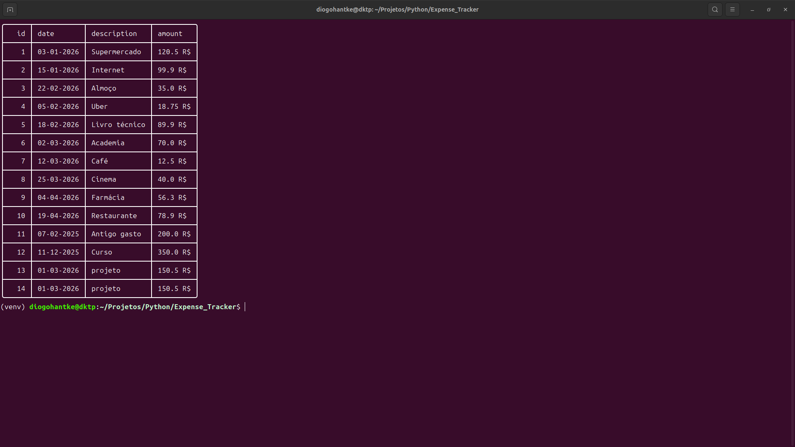
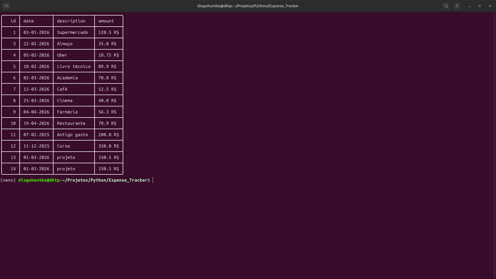
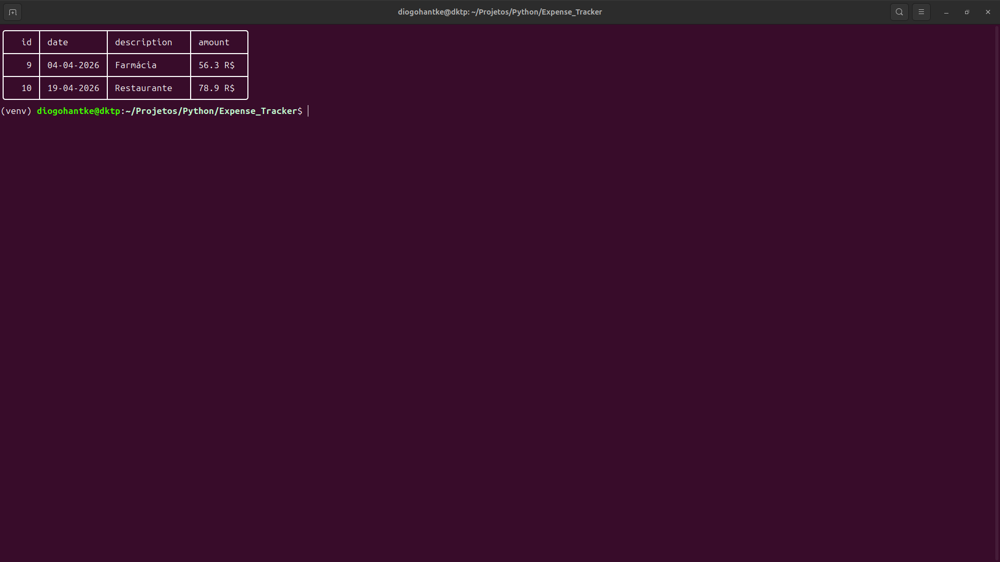
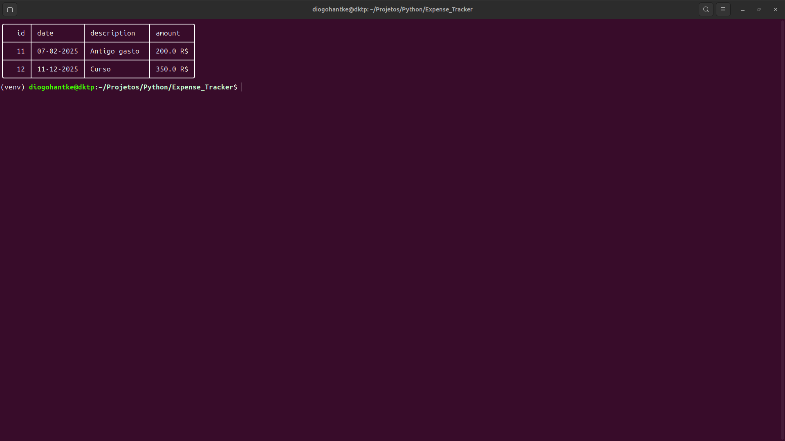
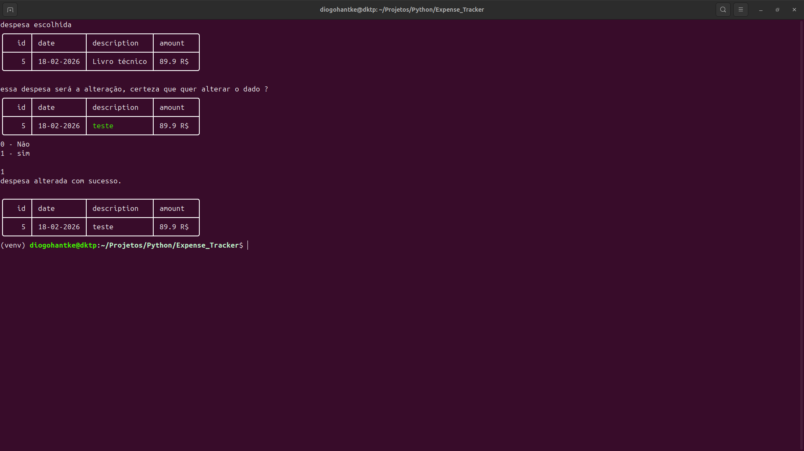
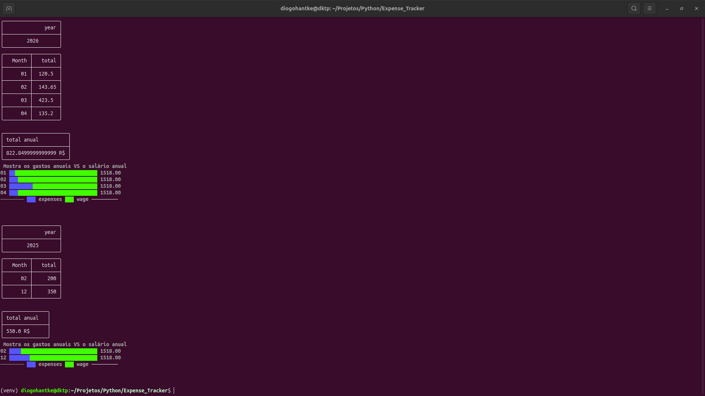
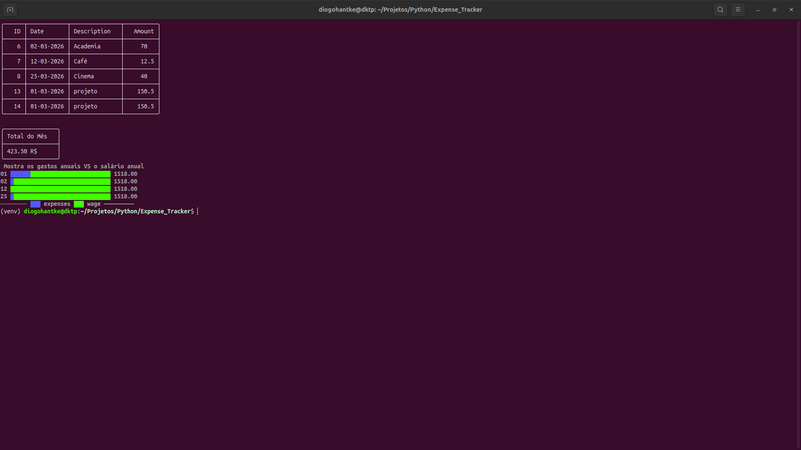
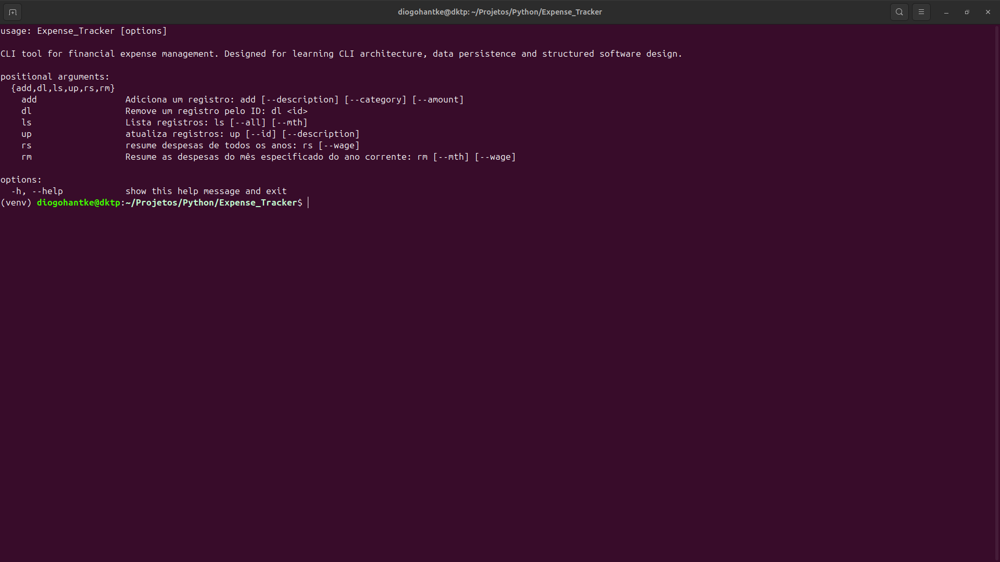

<h1>Expense Tracker CLI</h1>

Expense Tracker é uma aplicação de linha de comando (CLI) desenvolvida em Python
para gerenciamento de despesas pessoais, com persistência de dados em arquivo JSON,
listagem formatada em tabela e geração de relatórios financeiros.

O sistema permite adicionar, atualizar, excluir e visualizar despesas,
além de gerar resumos anuais e comparações gráficas entre gastos e salário.

<h2>Enunciado do Projeto</h2>

Este projeto foi desenvolvido com base no desafio proposto pela
<a href="https://roadmap.sh/projects/expense-tracker" target="_blank">
Roadmap.sh - Expense Tracker Project
</a>.

<blockquote>
Criar uma aplicação de rastreamento de despesas que permita adicionar,
remover e visualizar despesas, além de gerar resumos financeiros.
</blockquote>

Requisitos implementados:

<ul>
    <li>Execução via linha de comando.</li>
    <li>Adicionar despesas com descrição e valor.</li>
    <li>Atualizar despesas existentes.</li>
    <li>Excluir despesas por ID.</li>
    <li>Listar despesas com filtros por mês e ano.</li>
    <li>Gerar resumo anual.</li>
    <li>Gerar gráfico comparando despesas e salário.</li>
</ul>

<h2>Estrutura do Projeto</h2>

<pre><code>
.
├── main.py
├── expense.json
├── colors.py
└── README.md
</code></pre>

<h2>Funcionalidades e Lógica Interna</h2>

<h3>readJson()</h3>

Responsável por carregar os dados do arquivo JSON.
Caso o arquivo não exista, ele é criado automaticamente.
Também trata possíveis erros de corrupção do arquivo.

Função central de persistência do sistema.

<h3>writeJson(dict_data)</h3>

Responsável por salvar os dados atualizados no arquivo JSON.
É utilizada após operações de adição, atualização ou exclusão.

<h3>createParser()</h3>

Define a interface da aplicação utilizando <code>argparse</code>.
Configura os subcomandos disponíveis:

<ul>
    <li>add</li>
    <li>addw</li>
    <li>dl</li>
    <li>ls</li>
    <li>up</li>
    <li>rs</li>
</ul>

A função retorna os argumentos processados para serem utilizados
pelas funções correspondentes.

<h3>addExpense(args)</h3>

Adiciona uma nova despesa ao sistema.

Etapas internas:

<ul>
    <li>Validação de valor positivo.</li>
    <li>Geração automática de ID incremental.</li>
    <li>Registro da data atual.</li>
    <li>Inserção no JSON.</li>
    <li>Exibição da tabela atualizada.</li>
</ul>

<h3>deleteExpense(args)</h3>

Remove uma despesa com base no ID informado.
Caso o ID não exista, uma mensagem de erro é exibida.

<h3>updateExpense(args)</h3>

Permite atualizar descrição e/ou valor de uma despesa.

Antes de aplicar a alteração, o sistema:

<ul>
    <li>Exibe o registro atual.</li>
    <li>Mostra as modificações destacadas.</li>
    <li>Solicita confirmação do usuário.</li>
</ul>

<h3>viewAllExpense(args)</h3>

Lista as despesas cadastradas.
Permite filtros por mês, ano ou visualização completa.
Caso nenhum filtro seja informado, exibe o mês e ano atual.

<h3>resumeAllExpense(args)</h3>

Gera o resumo financeiro anual.

A função:

<ul>
    <li>Agrupa despesas por ano e mês.</li>
    <li>Calcula o total mensal.</li>
    <li>Calcula o total anual.</li>
    <li>Exibe tabela formatada.</li>
    <li>Gera gráfico comparando despesas com salário.</li>
</ul>

<h3>graphsExpense()</h3>

Responsável por gerar gráficos no terminal utilizando a biblioteca
<code>plotext</code>.

O gráfico compara os valores de despesas mensais com o salário informado.

<h2>Tecnologias Utilizadas</h2>

<ul>
    <li>Python 3</li>
    <li>argparse</li>
    <li>json</li>
    <li>os</li>
    <li>datetime</li>
    <li>tabulate</li>
    <li>plotext</li>
</ul>

<h2>Instalação</h2>

<pre><code>
git clone https://github.com/seu-usuario/expense-tracker.git
cd expense-tracker
</code></pre>

Instalar dependências:

<pre><code>
pip install tabulate
pip install plotext
</code></pre>

<h2>Como Executar</h2>

<pre><code>
python main.py &lt;comando&gt; [argumentos]
</code></pre>

<h2>Exemplos de Uso</h2>

<h3>Adicionar despesa</h3>

<code>python main.py add --description "Lunch" --amount 25</code>

  

  

<h3>Excluir despesa</h3>

<code>python main.py dl --id 1</code>

  

  

<h3>Listar despesas (mês atual)</h3>

<code>python main.py ls</code>

  

  

<h3>Listar despesas por ano</h3>

<code>python main.py ls --yr 2026</code>

  

  

<h3>Atualizar despesa</h3>

<code>python main.py up --id 1 --amount 40</code>

  

  

<h3>Resumo anual com gráfico</h3>

<code>python main.py rs --wage 5000</code>

  

  

<h3>Resumo mensal com gráfico</h3>

<code>python main.py rm --mth 2 --wage 5000</code>

  

  

<h3>Ajuda</h3>

<code>python main.py --help</code>

  

  

<h2>Decisões de Projeto</h2>

<ul>
    <li>Persistência baseada em JSON.</li>
    <li>Arquitetura funcional modular.</li>
    <li>Separação entre manipulação de dados e exibição.</li>
    <li>Uso de IDs automáticos.</li>
    <li>Validação básica de entrada.</li>
    <li>Geração de relatórios em tabela e gráfico.</li>
</ul>

<h2>Melhorias Futuras</h2>

<ul>
    <li>Separação em módulos.</li>
    <li>Implementação de banco SQLite.</li>
    <li>Testes automatizados.</li>
    <li>Sistema de categorias.</li>
    <li>Controle de orçamento mensal.</li>
    <li>Exportação para CSV.</li>
    <li>Refatoração orientada a objetos.</li>
</ul>

<h2>Objetivo Educacional</h2>

Projeto desenvolvido para consolidar conhecimentos em lógica de programação,
manipulação de arquivos, desenvolvimento de aplicações CLI,
organização de código e geração de relatórios financeiros.

